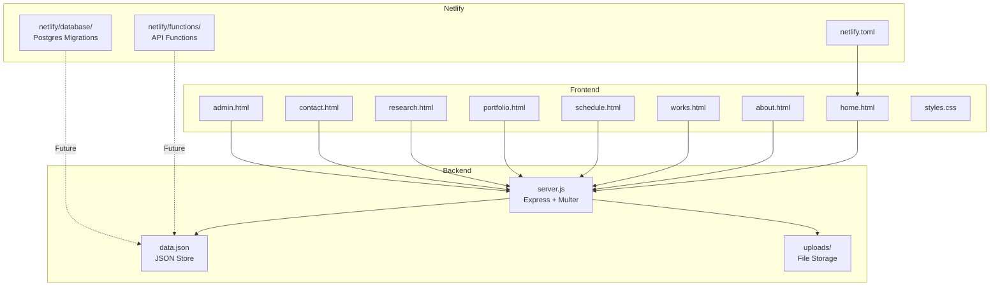

# Populian Faming Qin Website — Improvement Plan

## Current State Analysis

**Tech Stack:** Express.js + JSON storage + HTML/CSS/JS SPA-like pages + Netlify deployment

### Issues Found

1. **Image Paths Broken** — `data.json` has hardcoded `http://localhost:3000/uploads/image/hero.png` URLs that won't work in production. Multer saves to `/uploads/` but paths reference `/uploads/image/`. The `public/images/` and `public/upload/` directories contain placeholder files.

2. **Admin UX Gap** — Media upload works, but users must manually copy URLs from the media grid to paste into form fields (Cover Image, Hero Image, Portrait, etc.). No "insert from media library" button.

3. **Hero Section Basic** — Current hero is clean but static. No parallax, particle effects, or scroll-triggered animations that would make it "advanced."

4. **Works Page** — Uses a modal for details rather than a dedicated detail page. Category filtering works but layout is basic.

5. **Schedule Page** — Simple timeline list. Could be enhanced with visual calendar elements.

6. **Mobile Responsiveness** — Media queries exist (768px, 900px breakpoints) but need auditing for edge cases (tablets, very small phones, landscape).

7. **Project Structure** — Mixed-level directories (`uploads/` at root, `public/images/`, `public/upload/images/`) with placeholder test files.

8. **No Git History** — No `.git` directory initialized yet.

---

## Detailed Task Breakdown

### Task 1: Fix Image Path Issues

**Problem:** `data.json` stores:
```json
"heroImage": "http://localhost:3000/uploads/image/hero.png",
"portraitImage": "http://localhost:3000/uploads/image/portraits1.jpeg"
```

The multer upload saves to `/workspaces/MyWebsite/uploads/` and serves via `app.use('/uploads', express.static(uploadDir))`. So correct paths would be `/uploads/filename.ext`. The `/uploads/image/` subdirectory doesn't exist.

**Fix:**
- Update `data.json` to use relative paths `/uploads/<filename>` (set to empty string since files don't exist)
- Add a data migration in `server.js` to fix legacy `http://localhost:3000/` paths automatically on read
- Clean up `public/images/test.txt` and `public/upload/images/test` placeholder files

**Files:** [`data.json`](data.json), [`server.js`](server.js), delete [`public/images/test.txt`](public/images/test.txt), [`public/upload/images/test`](public/upload/images/test)

---

### Task 2: Clean Up Project Structure

**Actions:**
- Delete [`public/images/test.txt`](public/images/test.txt) (placeholder)
- Delete [`public/upload/images/test`](public/upload/images/test) (placeholder)
- Delete [`public/images/`](public/images/) directory entirely (empty after removing test.txt)
- Delete [`public/upload/`](public/upload/) directory entirely (no real content)
- Ensure [`uploads/`](uploads/) at root is the single source of truth for uploaded files
- Add `.gitignore` for standard Node + uploads patterns

---

### Task 3: Add Image Picker to Admin Panel

**Current:** Media Manager shows uploaded images. But to use one in e.g. "Cover Image URL", user must manually copy the URL text and paste into the form field.

**Fix:** Add a "Browse Media" button next to each image URL field. Clicking opens a modal/grid of uploaded images. Selecting one fills the URL field automatically.

**Fields affected in admin:**
- Home Editor: Hero Image URL, Portrait Image URL
- Works Manager: Cover Image URL
- Contact Editor: Press Photo URL

**Implementation:**
- Add a reusable `openMediaPicker(targetInputId)` JavaScript function in [`admin.html`](public/admin.html)
- Add a "📁 Browse Media" button next to each relevant URL input
- When clicked, show a modal with the media grid (reuse existing media data)
- On image click, set `targetInputId.value = selectedMedia.url`

---

### Task 4: Enhance Hero Section with Advanced Animations

**Current:** Static hero with gradient background, name, subtitle, optional photo.

**Enhancements:**
1. **Animated gradient background** — Subtle slow-shifting gradient using CSS `@keyframes`
2. **Parallax scroll effect** — Hero content moves at different speed than background on scroll (using CSS `transform` or JS scroll listener)
3. **Micro-interactions** — Text reveal animation on load (typewriter or fade-up staggered)
4. **Ambient floating particles** — Optional subtle floating dots using CSS pseudo-elements or a lightweight canvas (Apple-style)
5. **Smooth scroll indicators** — A subtle bouncing down-arrow indicator at the bottom of the hero section

**Files:** [`public/home.html`](public/home.html), [`public/styles.css`](public/styles.css)

---

### Task 5: Improve Works Page

**Enhancements:**
1. **Better card layout** — Add hover image zoom effect, overlay badges
2. **Enhanced modal/detail view** — Better typography, spacing, metadata layout
3. **Year range filter** — Add a secondary filter for year ranges alongside category
4. **Search** — Add a simple text search input to filter by title/description
5. **Animations** — Stagger card reveal on scroll using Intersection Observer

**Files:** [`public/works.html`](public/works.html), [`public/styles.css`](public/styles.css)

---

### Task 6: Improve Schedule Page

**Enhancements:**
1. **Visual timeline** — Add connecting line between timeline items
2. **Past/Future toggle** — Toggle to show upcoming events only vs all events
3. **Better date display** — Date badge/calendar icon styling
4. **Month grouping** — Group events by month with section headers
5. **Empty state** — Better empty state with CTA to admin

**Files:** [`public/schedule.html`](public/schedule.html), [`public/styles.css`](public/styles.css)

---

### Task 7: Comprehensive Mobile Responsiveness

**Audit at breakpoints:**
- **< 480px** (small phones): Nav, hero text sizing, card padding
- **768px** (tablets): 2-column grids, nav hamburger
- **900px** (small laptops): Hero photo layout
- **1024px+** (desktop): Full layout

**Specific fixes:**
- Ensure touch targets are >= 44px (Apple HIG)
- Fix potential overflow in hero photo on narrow screens
- Add `-webkit-overflow-scrolling: touch` for modals
- Test form inputs on mobile (zoom prevention with `font-size: 16px`)
- Improve gallery grid on small screens (2 columns instead of 1)

**Files:** [`public/styles.css`](public/styles.css)

---

### Task 8: Apple-Style UI Polish

**Refinements:**
1. **Smoother transitions** — Add transition to page header gradient
2. **Card improvements** — More prominent featured badge, subtle shadow enhancements
3. **Typography** — Better font weight hierarchy, refined letter-spacing
4. **Button consistency** — Ensure all buttons use same pill-radius style
5. **Footer** — Add social links to footer
6. **Navigation** — Add active page indicator animation
7. **Loading states** — Consistent loading spinner across all pages
8. **Accessibility** — Add `prefers-reduced-motion` support

**Files:** [`public/styles.css`](public/styles.css), all HTML pages for accessibility attributes

---

### Task 9: Git Setup and Commit

**Actions:**
- Initialize git repo
- Create `.gitignore` (node_modules, uploads/*, .env, data.json backups)
- Stage all files
- Create initial commit with descriptive message

---

## Architecture Diagram



## Implementation Order

1. Fix image paths + data migration (Task 1)
2. Clean project structure (Task 2)
3. Add image picker to admin (Task 3)
4. Enhance Hero section (Task 4)
5. Improve Works page (Task 5)
6. Improve Schedule page (Task 6)
7. Mobile responsiveness audit (Task 7)
8. UI polish (Task 8)
9. Git commit (Task 9)
